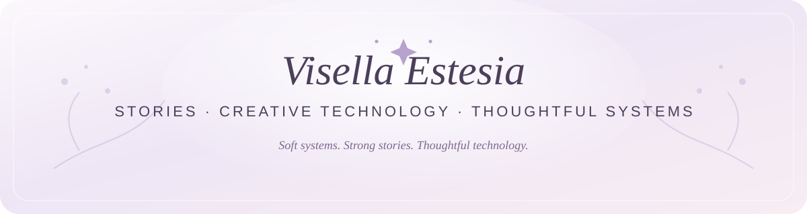

*Writer · Creator · Builder of thoughtful digital experiences*

**Stories first. Technology in service of them.**

---

### ✦ Hello

I'm **Visella Estesia**, a writer and creator who enjoys turning stories, ideas, and everyday creative problems into thoughtful digital projects.

My work lives somewhere between **fiction, creative systems, and personal AI tools** — with a preference for things that feel calm, intentional, and human.

### ✦ Selected work

**NovelCompanion**  
An AI-assisted creative studio for long-form fiction, designed around specialized roles for writing, canon control, editorial review, visuals, strategy, marketing, and project management.

**Aveline**  
A private local-first AI experiment exploring on-device inference, persistent identity, structured memory, and personal software that can grow without losing its sense of continuity.

**Vilesia**  
My wider creative home for writing, digital projects, and things I'm still quietly building.

### ✦ Creative direction

I care about emotional writing, elegant systems, useful technology, and tools that support creativity without overwhelming the person using them.

> *Soft systems. Strong stories. Thoughtful technology.*

### ✦ Find me

🌷 **Website:** [visella.vilesia.com](https://visella.vilesia.com)

---

Made with care by Visella Estesia.

